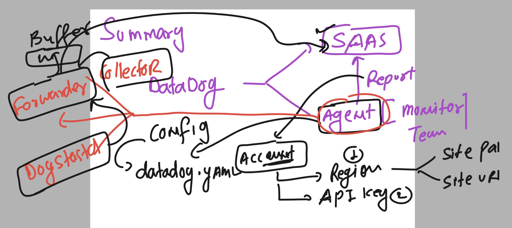
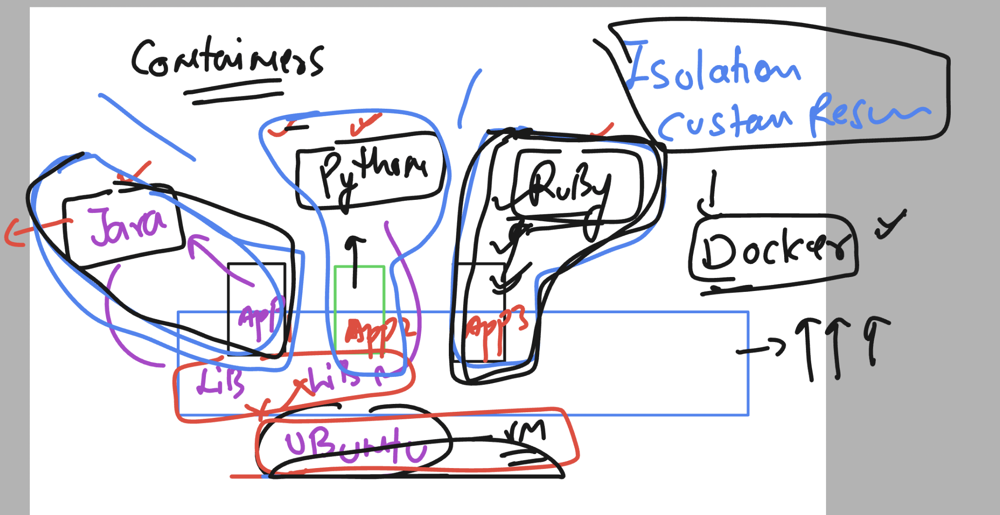

### Certification and training 


### SAAS model -- Datadog 


### datadog agent 


### Using datadog -- understanding basic subscription model 


### Understanding lab env 


## Loging to ubuntu VM using ssh from windows Powershell

```
PS C:\Users\humanfirmware> cd .\Downloads\
PS C:\Users\humanfirmware\Downloads>
PS C:\Users\humanfirmware\Downloads> ssh  -i  ashu-datadog.pem   ubuntu@44.202.148.132
The authenticity of host '44.202.148.132 (44.202.148.132)' can't be established.
ED25519 key fingerprint is SHA256:pJGZrbZsRK/jW/cB9Czj3PN7uoWX5r+lB1hFfWa5XPs.
This key is not known by any other names
Are you sure you want to continue connecting (yes/no/[fingerprint])? yes
Warning: Permanently added '44.202.148.132' (ED25519) to the list of known hosts.
Welcome to Ubuntu 22.04.3 LTS (GNU/Linux 6.2.0-1012-aws x86_64)

 * Documentation:  https://help.ubuntu.com
 * Management:     https://landscape.canonical.com
 * Support:        https://ubuntu.com/advantage

```

### verify login 

```
ubuntu@ip-172-31-90-155:~$ uname
Linux
ubuntu@ip-172-31-90-155:~$
ubuntu@ip-172-31-90-155:~$
ubuntu@ip-172-31-90-155:~$ whoami
ubuntu
```

## datadog agent installation on Ubuntu machine 

### step 1 -- update ubuntu repo 

```
sudo apt update
```

### go to datadog account platform (SAAS) -- select agent of ubuntu 


### installing it 

```
ubuntu@ip-172-31-90-155:~$ sudo -i
root@ip-172-31-90-155:~#

 DD_API_KEY=a DD_SITE="datadoghq.com" bash -c "$(curl -L https://s3.amazonaws.com/dd-agent/scripts/install_script_agent7.sh)"

  % Total    % Received % Xferd  Average Speed   Time    Time     Time  Current
                                 Dload  Upload   Total   Spent    Left  Speed
100 45923  100 45923    0     0   391k      0 --:--:-- --:--:-- --:--:--  393k

* Datadog Agent 7 install script v1.23.0


* Installing apt-transport-https, curl and gnupg

Hit:1 http://us-east-1.ec2.archive.ubuntu.com/ubuntu jammy InRelease
Get:2 http://us-east-1.ec2.archive.ubuntu.com/ubuntu jammy-updates InRelease [119 kB]
Hit:3 http://us-east-1.ec2.archive.ubuntu.com/ubuntu jammy-backports InRelease
Hit:4 http://security.ubuntu.com/ubuntu jammy-security InRelease
Fetched 119 kB in 0s (243 kB/s)
Reading package lists...
Reading package lists...
Building dependency tree...
Reading state information...
gnupg is already the newest version (2.2.27-3ubuntu2.1).
gnupg set to manually installed.
The following NEW packages will be installed:
```

### verify agent installation 

```

* Adding your API key to the Datadog Agent configuration: /etc/datadog-agent/datadog.yaml


* Setting SITE in the Datadog Agent configuration: /etc/datadog-agent/datadog.yaml

/usr/bin/systemctl
* Starting the Datadog Agent...

  Your Datadog Agent is running and functioning properly.
  It will continue to run in the background and submit metrics to Datadog.
  If you ever want to stop the Datadog Agent, run:

       systemctl stop datadog-agent

  And to run it again run:

       systemctl start datadog-agent
```

### More steps to check 

```
root@ip-172-31-90-155:~# systemctl status datadog-agent
● datadog-agent.service - Datadog Agent
     Loaded: loaded (/lib/systemd/system/datadog-agent.service; enabled; vendor preset: enabled)
     Active: active (running) since Tue 2023-11-21 06:04:39 UTC; 8min ago
   Main PID: 3025 (agent)
      Tasks: 9 (limit: 4667)
     Memory: 94.9M
        CPU: 6.481s
     CGroup: /system.slice/datadog-agent.service
             └─3025 /opt/datadog-agent/bin/agent/agent run -p /opt/datadog-agent/run/agent.pid

```

### checking dashboard of datadog -- after clicking on finish button 

### Note: in some cases it can take up to 10 minutes 


### datadog site ULR for agent configuration 


### chekcing datadog agent configuration file 

```
 cd  /etc/datadog-agent/
root@ip-172-31-90-155:/etc/datadog-agent# ls
auth_token    conf.d                install_info                 selinux
checks.d      datadog.yaml          runtime-security.d           system-probe.yaml.example
compliance.d  datadog.yaml.example  security-agent.yaml.example
```

### to see file use less or any relevant command in linux 

```
less  datadog.yaml
```


### default reporting component 


### datadog agent architecture -- and component 


### How to enable process monitoring in datadog agent yaml file 

```
root@ip-172-31-90-155:/etc/datadog-agent# pwd
/etc/datadog-agent
root@ip-172-31-90-155:/etc/datadog-agent# ls
auth_token  compliance.d  datadog.yaml          install_info        security-agent.yaml.example  system-probe.yaml.example
checks.d    conf.d        datadog.yaml.example  runtime-security.d  selinux
root@ip-172-31-90-155:/etc/datadog-agent#
root@ip-172-31-90-155:/etc/datadog-agent#
root@ip-172-31-90-155:/etc/datadog-agent# wc -l  datadog.yaml
3207 datadog.yaml


root@ip-172-31-90-155:/etc/datadog-agent# grep -in process_config   datadog.yaml
567:  ## - process_config.process_dd_url
1538:## @param process_config - custom object - optional
1543:# process_config:
1561:  ## @env DD_PROCESS_CONFIG_ENABLED - string - optional - default: "false"
1570:  ## @env DD_PROCESS_CONFIG_EXPVAR_PORT - string - optional - default: 6062
1581:  ## @env DD_PROCESS_CONFIG_LOG_FILE - string - optional
1587:  ## @env DD_PROCESS_CONFIG_INTERVALS_CONTAINER - integer - optional - default: 10
1588:  ## @env DD_PROCESS_CONFIG_INTERVALS_CONTAINER_REALTIME - integer - optional - default: 2
1589:  ## @env DD_PROCESS_CONFIG_INTERVALS_PROCESS - integer - optional - default: 10
1590:  ## @env DD_PROCESS_CONFIG_INTERVALS_PROCESS_REALTIME - integer - optional - default: 2
1613:  ## @env DD_PROCESS_CONFIG_BLACKLIST_PATTERNS - space separated list of strings - optional
1620:  ## @env DD_PROCESS_CONFIG_QUEUE_SIZE - integer - optional - default: 256
1626:  ## @env DD_PROCESS_CONFIG_PROCESS_QUEUE_BYTES - integer - optional - default: 60000000
1632:  ## @env DD_PROCESS_CONFIG_RT_QUEUE_SIZE - integer - optional - default: 5
1638:  ## @env DD_PROCESS_CONFIG_MAX_PER_MESSAGE - integer - optional - default: 100
1644:  ## @env DD_PROCESS_CONFIG_DD_AGENT_BIN - string - optional
1652:  ## @env DD_PROCESS_CONFIG_DD_AGENT_ENV - string - optional - default: ""
1658:  ## @env DD_PROCESS_CONFIG_SCRUB_ARGS - boolean - optional - default: true
1664:  ## @env DD_PROCESS_CONFIG_CUSTOM_SENSITIVE_WORDS - space separated list of strings - optional
1676:  ## @env DD_PROCESS_CONFIG_DISABLE_REALTIME - boolean - optional - default: false


root@ip-172-31-90-155:/etc/datadog-agent#
root@ip-172-31-90-155:/etc/datadog-agent#
root@ip-172-31-90-155:/etc/datadog-agent#
root@ip-172-31-90-155:/etc/datadog-agent# vim  +1543    datadog.yaml # to openfile in that linenumber 

root@ip-172-31-90-155:/etc/datadog-agent#
root@ip-172-31-90-155:/etc/datadog-agent# systemctl restart  datadog-agent
root@ip-172-31-90-155:/etc/datadog-agent#
root@ip-172-31-90-155:/etc/datadog-agent# systemctl status  datadog-agent
● datadog-agent.service - Datadog Agent
     Loaded: loaded (/lib/systemd/system/datadog-agent.service; enabled; vendor preset: enabled)
     Active: active (running) since Tue 2023-11-21 09:52:58 UTC; 10s ago
   Main PID: 41429 (agent)
      Tasks: 8 (limit: 4667)
     Memory: 80.8M
        CPU: 1.323s
     CGroup: /system.slice/datadog-agent.service
             └─41429 /opt/datadog-agent/bin/agent/agent run -p /opt/datadog-agent/run/agent.pid

Nov 21 09:53:00 ip-172-31-90-155 agent[41429]: 2023-11-21 09:53:00 UTC | CORE | INFO | (pkg/collector/worker/check_logger.go:39 in Ch>
Nov 21 09:53:00 ip-172-31-90-155 agent[41429]: 2023-11-21 09:53:00 UTC | CORE | INFO | (pkg/collector/worker/check_logger.go:58 in Ch>
Nov 21 09:53:04 ip-172-31-90-155 agent[41429]: 2023-11-21 09:53:04 UTC | CORE | INFO | (pkg/collector/worker/check_logger.go:39 in Ch>
Nov 21 09:53:04 ip-172-31-90-155 agent[41429]: 2023-11-21 09:53:04 UTC | CORE | INFO | (pkg/collector/worker/check_logger.go:58 in Ch>
Nov 21 09:53:05 ip-172-31-90-155 agent[41429]: 2023-11-21 09:53:05 UTC | CORE | INFO | (pkg/collector/worker/check_logger.go:39 in Ch>
Nov 21 09:53:05 ip-172-31-90-155 agent[41429]: 2023-11-21 09:53:05 UTC | CORE | INFO | (pkg/collector/worker/check_logger.go:58 in Ch>
Nov 21 09:53:06 ip-172-31-90-155 agent[41429]: 2023-11-21 09:53:06 UTC | CORE | INFO | (pkg/collector/worker/check_logger.go:39 in Ch>
Nov 21 09:53:06 ip-172-31-90-155 agent[41429]: 2023-11-21 09:53:06 UTC | CORE | INFO | (pkg/collector/worker/check_logger.go:58 in Ch>
Nov 21 09:53:07 ip-172-31-90-155 agent[41429]: 2023-11-21 09:53:07 UTC | CORE | INFO | (pkg/collector/worker/check_logger.go:39 in Ch>
Nov 21 09:53:07 ip-172-31-90-155 agent[41429]: 2023-11-21 09:53:07 UTC | CORE | INFO | (pkg/collector/worker/check_logger.go:58 in Ch>
root@ip-172-31-90-155:/etc/datadog-agent#
```

### changes we made

```
process_config:
  process_collection:
    enabled: true
```

### summary of datadog fundamentals



### more datadog commands 

```
root@ip-172-31-90-155:~# datadog-agent  status
Getting the status from the agent.


===============
Agent (v7.49.1)
===============

  Status date: 2023-11-21 10:16:22.342 UTC (1700561782342)
  Agent start: 2023-11-21 09:52:58.192 UTC (1700560378192)
  Pid: 41429
  Go Version: go1.20.10
  Python Version: 3.9.18
  Build arch: amd64
  Agent flavor: agent
  Check Runners: 4
```

### containers intro



### installing docker and checking container 

```
  59  apt  install docker.io
   60  history
root@ip-172-31-90-155:~#
root@ip-172-31-90-155:~# docker  ps
CONTAINER ID   IMAGE     COMMAND   CREATED   STATUS    PORTS     NAMES
root@ip-172-31-90-155:~#
root@ip-172-31-90-155:~#

```

