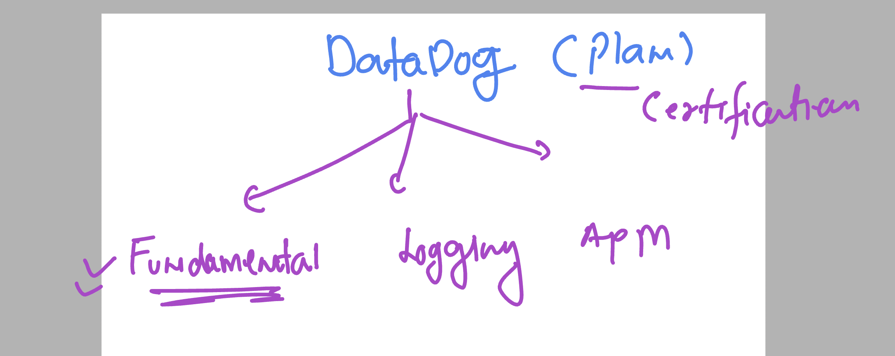
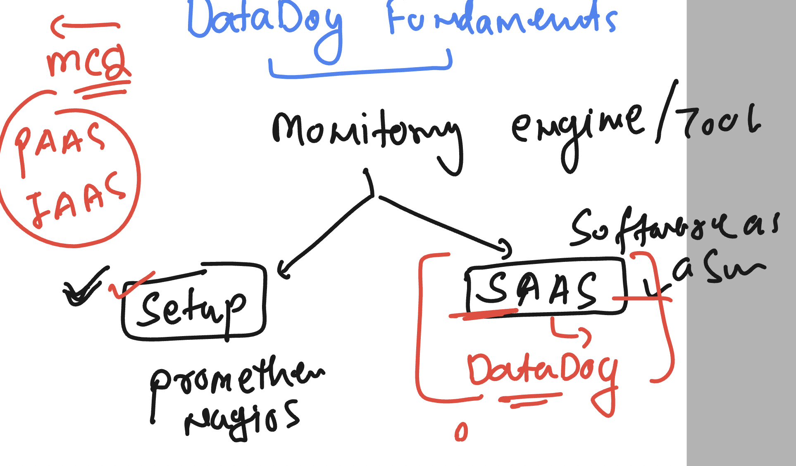
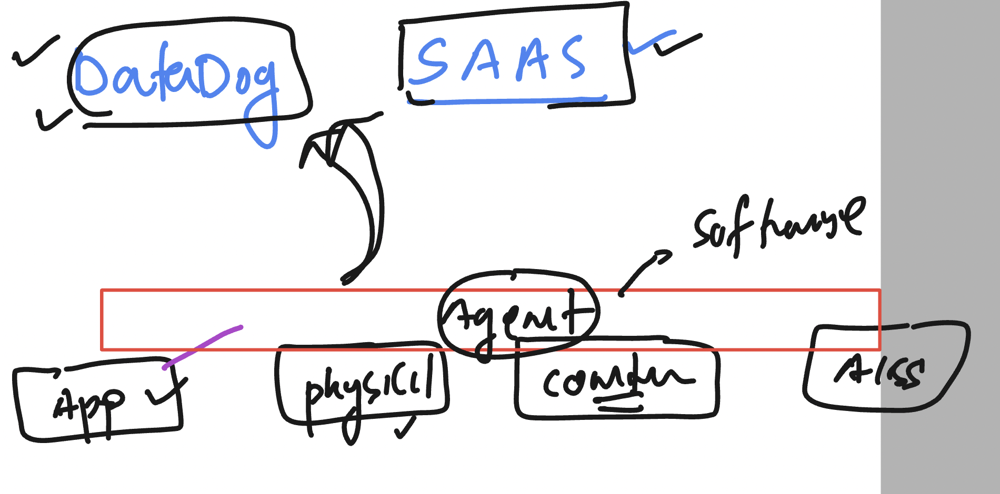
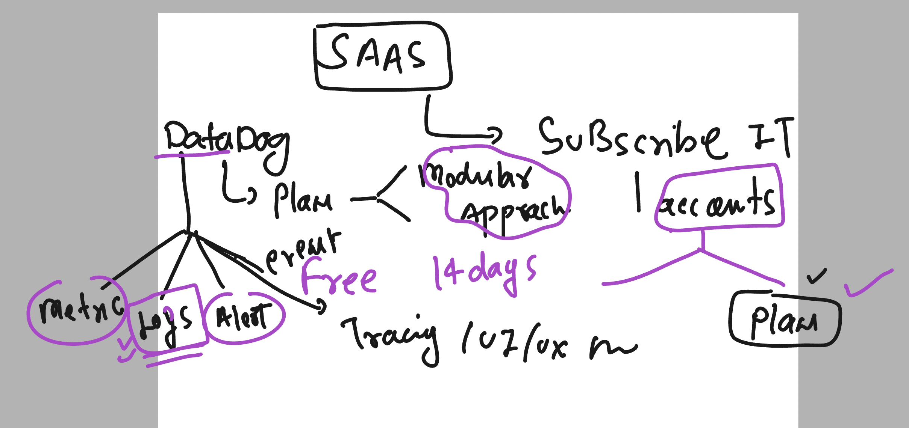
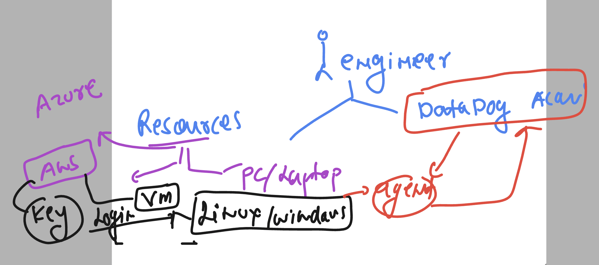
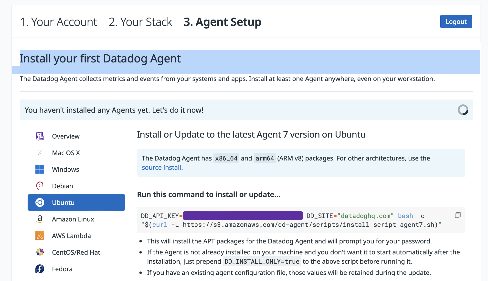
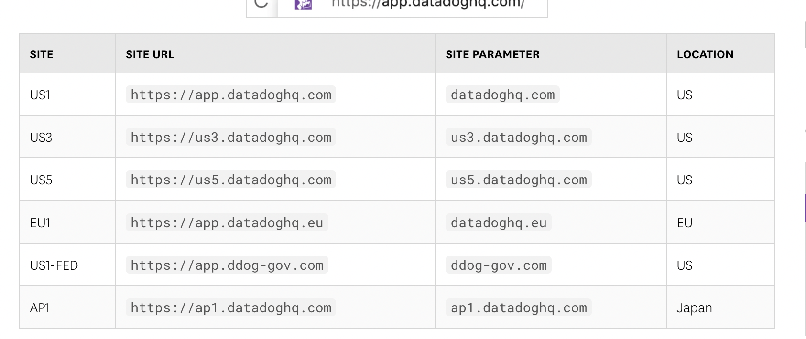
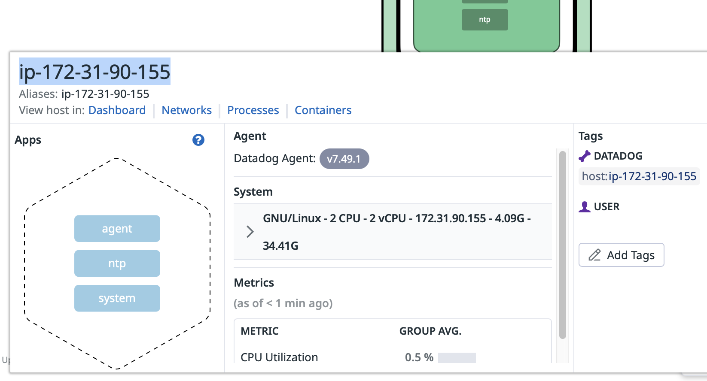
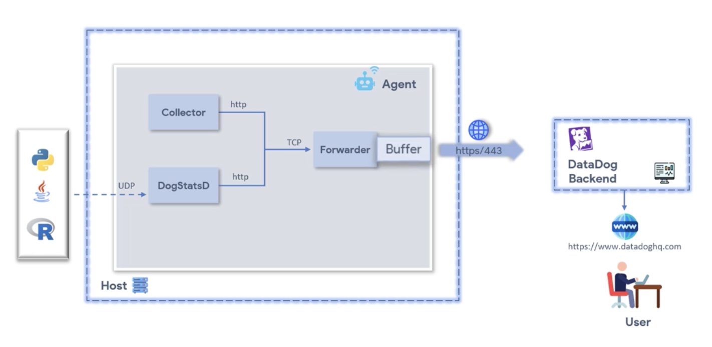

### Certification and training 



### SAAS model -- Datadog 



### datadog agent 



### Using datadog -- understanding basic subscription model 



### Understanding lab env 




## Loging to ubuntu VM using ssh from windows Powershell

```
PS C:\Users\humanfirmware> cd .\Downloads\
PS C:\Users\humanfirmware\Downloads>
PS C:\Users\humanfirmware\Downloads> ssh  -i  ashu-datadog.pem   ubuntu@44.202.148.132
The authenticity of host '44.202.148.132 (44.202.148.132)' can't be established.
ED25519 key fingerprint is SHA256:pJGZrbZsRK/jW/cB9Czj3PN7uoWX5r+lB1hFfWa5XPs.
This key is not known by any other names
Are you sure you want to continue connecting (yes/no/[fingerprint])? yes
Warning: Permanently added '44.202.148.132' (ED25519) to the list of known hosts.
Welcome to Ubuntu 22.04.3 LTS (GNU/Linux 6.2.0-1012-aws x86_64)

 * Documentation:  https://help.ubuntu.com
 * Management:     https://landscape.canonical.com
 * Support:        https://ubuntu.com/advantage

```

### verify login 

```
ubuntu@ip-172-31-90-155:~$ uname
Linux
ubuntu@ip-172-31-90-155:~$
ubuntu@ip-172-31-90-155:~$
ubuntu@ip-172-31-90-155:~$ whoami
ubuntu
```

## datadog agent installation on Ubuntu machine 

### step 1 -- update ubuntu repo 

```
sudo apt update
```

### go to datadog account platform (SAAS) -- select agent of ubuntu 



### installing it 

```
ubuntu@ip-172-31-90-155:~$ sudo -i
root@ip-172-31-90-155:~#

 DD_API_KEY=a DD_SITE="datadoghq.com" bash -c "$(curl -L https://s3.amazonaws.com/dd-agent/scripts/install_script_agent7.sh)"

  % Total    % Received % Xferd  Average Speed   Time    Time     Time  Current
                                 Dload  Upload   Total   Spent    Left  Speed
100 45923  100 45923    0     0   391k      0 --:--:-- --:--:-- --:--:--  393k

* Datadog Agent 7 install script v1.23.0


* Installing apt-transport-https, curl and gnupg

Hit:1 http://us-east-1.ec2.archive.ubuntu.com/ubuntu jammy InRelease
Get:2 http://us-east-1.ec2.archive.ubuntu.com/ubuntu jammy-updates InRelease [119 kB]
Hit:3 http://us-east-1.ec2.archive.ubuntu.com/ubuntu jammy-backports InRelease
Hit:4 http://security.ubuntu.com/ubuntu jammy-security InRelease
Fetched 119 kB in 0s (243 kB/s)
Reading package lists...
Reading package lists...
Building dependency tree...
Reading state information...
gnupg is already the newest version (2.2.27-3ubuntu2.1).
gnupg set to manually installed.
The following NEW packages will be installed:
```

### verify agent installation 

```

* Adding your API key to the Datadog Agent configuration: /etc/datadog-agent/datadog.yaml


* Setting SITE in the Datadog Agent configuration: /etc/datadog-agent/datadog.yaml

/usr/bin/systemctl
* Starting the Datadog Agent...

  Your Datadog Agent is running and functioning properly.
  It will continue to run in the background and submit metrics to Datadog.
  If you ever want to stop the Datadog Agent, run:

       systemctl stop datadog-agent

  And to run it again run:

       systemctl start datadog-agent
```

### More steps to check 

```
root@ip-172-31-90-155:~# systemctl status datadog-agent
● datadog-agent.service - Datadog Agent
     Loaded: loaded (/lib/systemd/system/datadog-agent.service; enabled; vendor preset: enabled)
     Active: active (running) since Tue 2023-11-21 06:04:39 UTC; 8min ago
   Main PID: 3025 (agent)
      Tasks: 9 (limit: 4667)
     Memory: 94.9M
        CPU: 6.481s
     CGroup: /system.slice/datadog-agent.service
             └─3025 /opt/datadog-agent/bin/agent/agent run -p /opt/datadog-agent/run/agent.pid

```

### checking dashboard of datadog -- after clicking on finish button 

### Note: in some cases it can take up to 10 minutes 


### datadog site ULR for agent configuration 



### chekcing datadog agent configuration file 

```
 cd  /etc/datadog-agent/
root@ip-172-31-90-155:/etc/datadog-agent# ls
auth_token    conf.d                install_info                 selinux
checks.d      datadog.yaml          runtime-security.d           system-probe.yaml.example
compliance.d  datadog.yaml.example  security-agent.yaml.example
```

### to see file use less or any relevant command in linux 

```
less  datadog.yaml
```


### default reporting component 



### datadog agent architecture -- and component 




