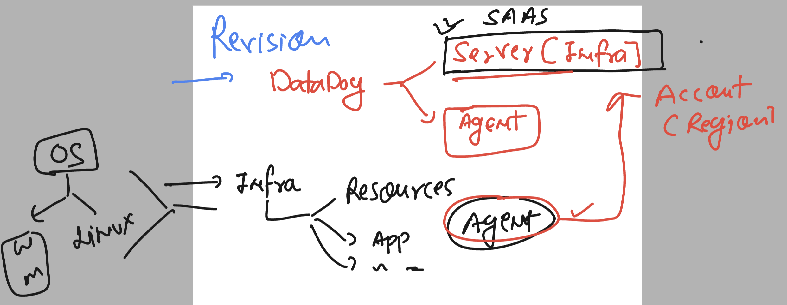
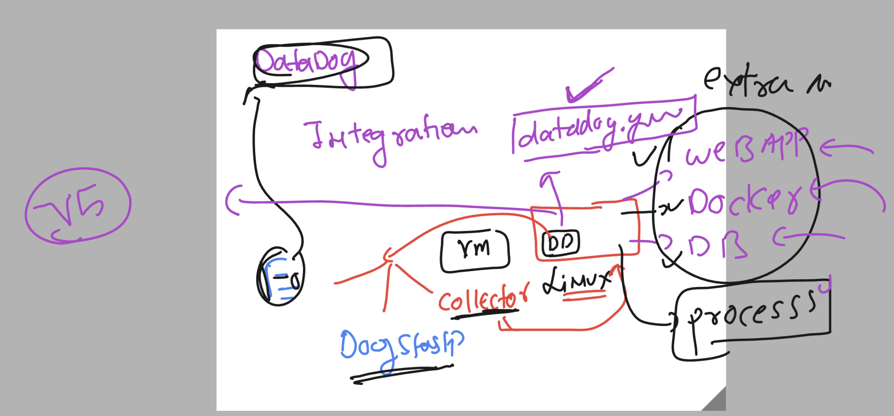
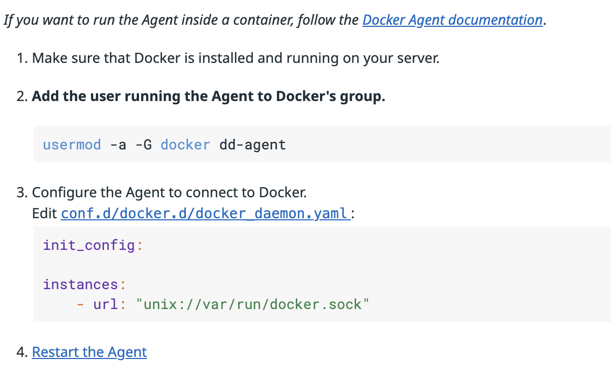
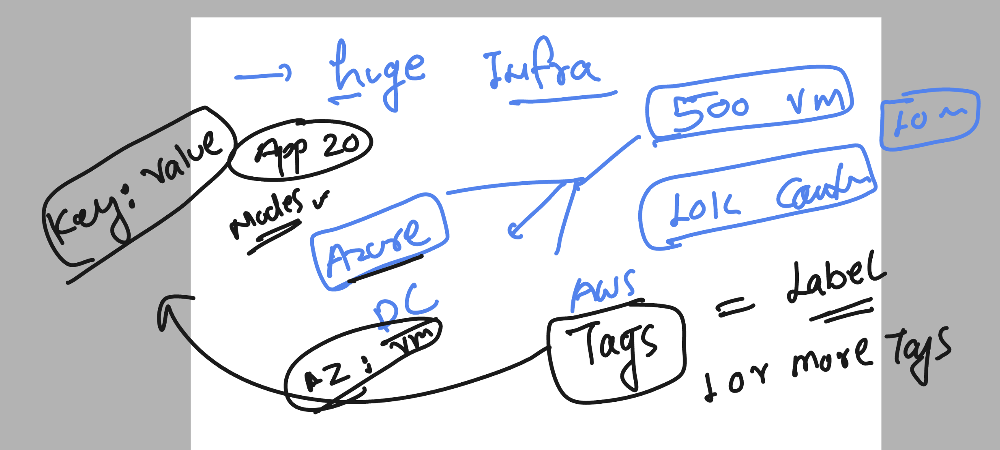
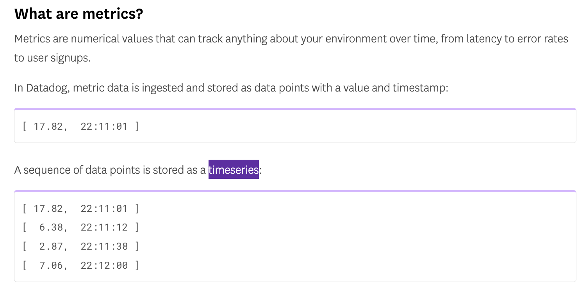
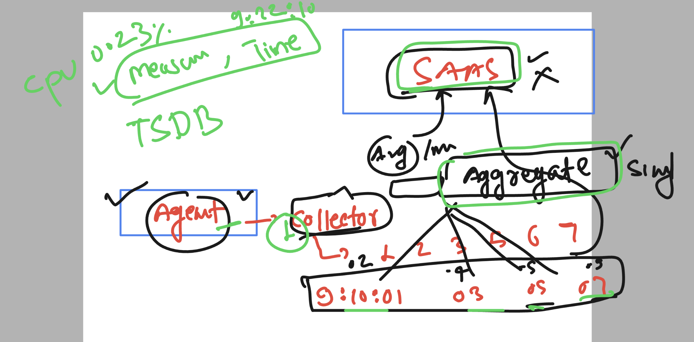
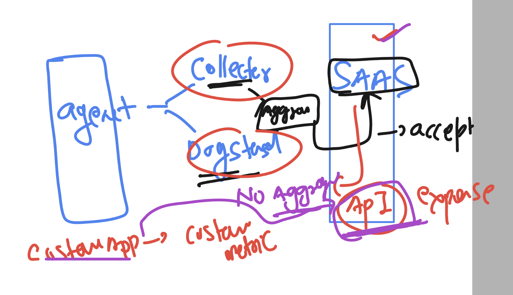

# datadog-fundamental_training

## revision 



### hands-on revision 

### checking linux host details 

```
ubuntu@ip-172-31-90-155:~$ whoami
ubuntu
ubuntu@ip-172-31-90-155:~$ uname
Linux
ubuntu@ip-172-31-90-155:~$ uname -r
6.2.0-1012-aws
ubuntu@ip-172-31-90-155:~$ cat  /etc/os-*
PRETTY_NAME="Ubuntu 22.04.3 LTS"
NAME="Ubuntu"
VERSION_ID="22.04"
VERSION="22.04.3 LTS (Jammy Jellyfish)"
VERSION_CODENAME=jammy
ID=ubuntu
ID_LIKE=debian
HOME_URL="https://www.ubuntu.com/"
```

### checking agent status

```
ubuntu@ip-172-31-90-155:~$ whoami
ubuntu
ubuntu@ip-172-31-90-155:~$
ubuntu@ip-172-31-90-155:~$ sudo  systemctl status datadog-agent
● datadog-agent.service - Datadog Agent
     Loaded: loaded (/lib/systemd/system/datadog-agent.service; enabled; vendor preset: enabled)
     Active: active (running) since Tue 2023-11-21 17:22:30 UTC; 11h ago
   Main PID: 19980 (agent)
      Tasks: 9 (limit: 4667)
     Memory: 87.1M
        CPU: 5min 43.732s
     CGroup: /system.slice/datadog-agent.service
             └─19980 /opt/datadog-agent/bin/agent/agent run -p /opt/datadog-agent/run/agent.pid
```

### alternativ

```
 sudo  service datadog-agent status
● datadog-agent.service - Datadog Agent
     Loaded: loaded (/lib/systemd/system/datadog-agent.service; enabled; vendor preset: enabled)
     Active: active (running) since Tue 2023-11-21 17:22:30 UTC; 11h ago
   Main PID: 19980 (agent)
      Tasks: 9 (limit: 4667)
     Memory: 87.5M
        CPU: 5min 44.104s
     CGroup: /system.slice/datadog-agent.service
             └─19980 /opt/datadog-agent/bin/agent/agent run -p /opt/datadog-agent/run/agent.pid
```

### final way to check datadog agent status

```
 datadog-agent status
Getting the status from the agent.


===============
Agent (v7.49.1)
===============

  Status date: 2023-11-22 04:40:30.846 UTC (1700628030846)
  Agent start: 2023-11-21 17:22:30.464 UTC (1700587350464)
  Pid: 19980
  Go Version: go1.20.10
  Python Version: 3.9.18
  Build arch: amd64
  Agent flavor: agent
  Check Runners: 4
  Log Level: info

  Paths
  =====
```


### checking config file 

```
 cd   /etc/datadog-agent/
root@ip-172-31-90-155:/etc/datadog-agent# ls
auth_token    conf.d                install_info                 selinux
checks.d      datadog.yaml          runtime-security.d           system-probe.yaml.example
compliance.d  datadog.yaml.example  security-agent.yaml.example
root@ip-172-31-90-155:/etc/datadog-agent#
```


### datadog agent info 



### docker integration with datadog agent -- using integration approach not using datadog.yaml file 

### for integration conf dir 

```
 cd  /etc/datadog-agent/
root@ashu-ubuntu:/etc/datadog-agent# ls
auth_token  compliance.d  datadog.yaml          install_info        security-agent.yaml.example  system-probe.yaml.example
checks.d    conf.d        datadog.yaml.example  runtime-security.d  selinux
root@ashu-ubuntu:/etc/datadog-agent# cd  conf.d/
root@ashu-ubuntu:/etc/datadog-agent/conf.d# ls
activemq.d             crio.d                   ibm_was.d                  network.d                   solr.d
activemq_xml.d         datadog_cluster_agent.d  ignite.d                   nfsstat.d                   sonarqube.d
aerospike.d            dcgm.d                   impala.d                   nginx.d                     spark.d
airflow.d              directory.d              io.d                       nginx_ingress_controller.d  sqlserver.d
amazon_msk.d           disk.d                   istio.d                    ntp.d                       squid.d
ambari.d               dns_check.d              jboss_wildfly.d            oom_kill.d                  ssh_check.d
apache.d               docker.d                 jetson.d                   openldap.d                  statsd.d
arangodb.d             druid.d                  jmx.d      
```

### checking user

```
root@ip-172-31-90-155:/etc/datadog-agent/conf.d# grep agent  /etc/passwd
dd-agent:x:115:122::/opt/datadog-agent:/usr/sbin/nologin
```

### Integration of docker with datadog 

```
 usermod  -aG  docker  dd-agent 
root@ashu-ubuntu:~# cd  /etc/datadog-agent/conf.d/docker.d/
root@ashu-ubuntu:/etc/datadog-agent/conf.d/docker.d# ls
conf.yaml.default

```

### adding data in file as given 



### creating container 

```
docker  run -d --name ashuc1   nginx  
12316fcd3a369949574192335cebca8d5b6a051d41ead2a81f2ce9e815a08da7
root@ashu-ubuntu:~# docker  ps
CONTAINER ID   IMAGE     COMMAND                  CREATED              STATUS          PORTS     NAMES
12316fcd3a36   nginx     "/docker-entrypoint.…"   About a minute ago   Up 59 seconds   80/tcp    ashuc1
a9a31387efc0   nginx     "/docker-entrypoint.…"   38 minutes ago       Up 38 minutes   80/tcp    c1
root@ashu-ubuntu:~# 

```

## Introduction to tags in datadog 



## Introduction to metrics -- aggregation and type 



### more info 



### datadog API can directly accept metric without any aggregation 




