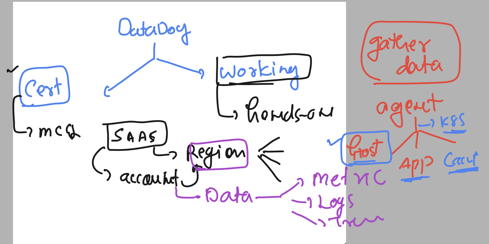
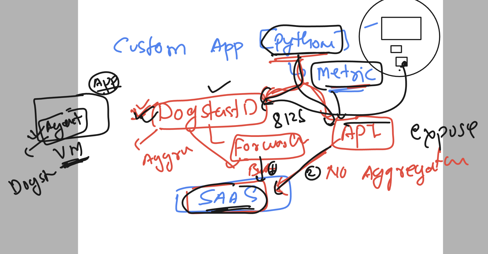
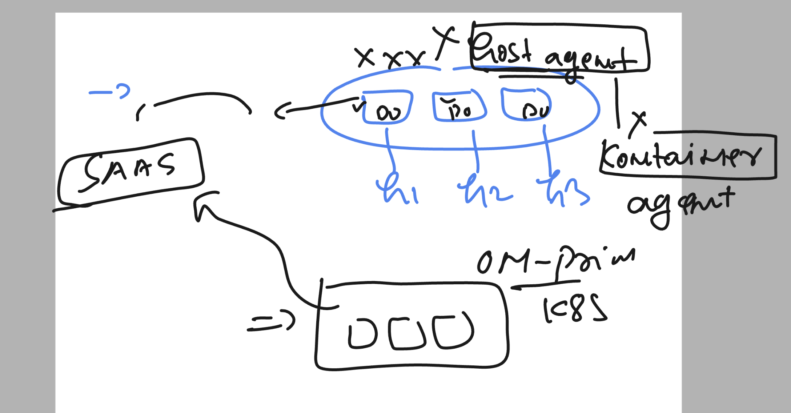
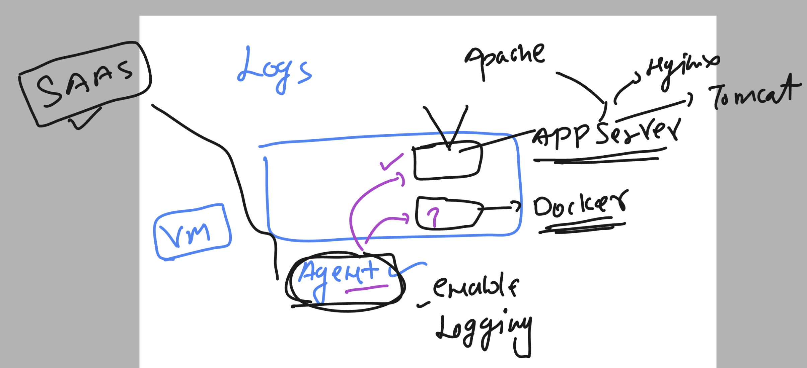
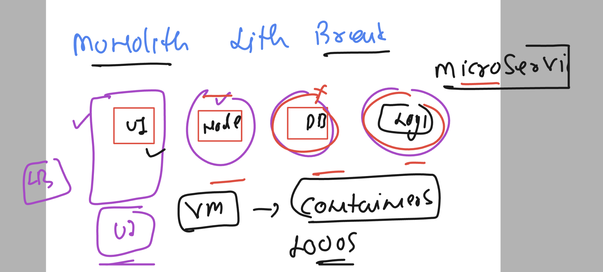
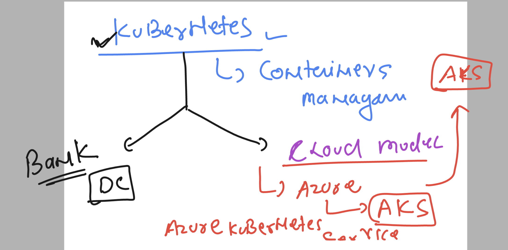
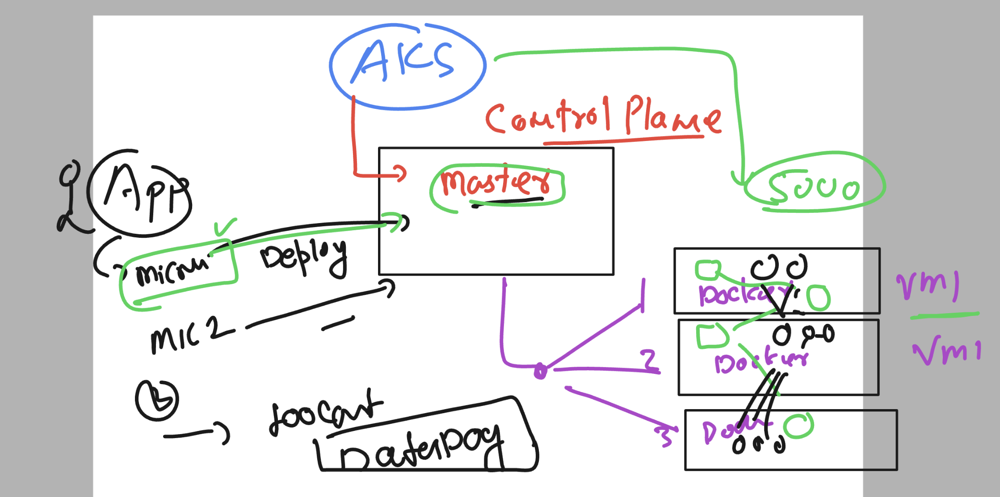
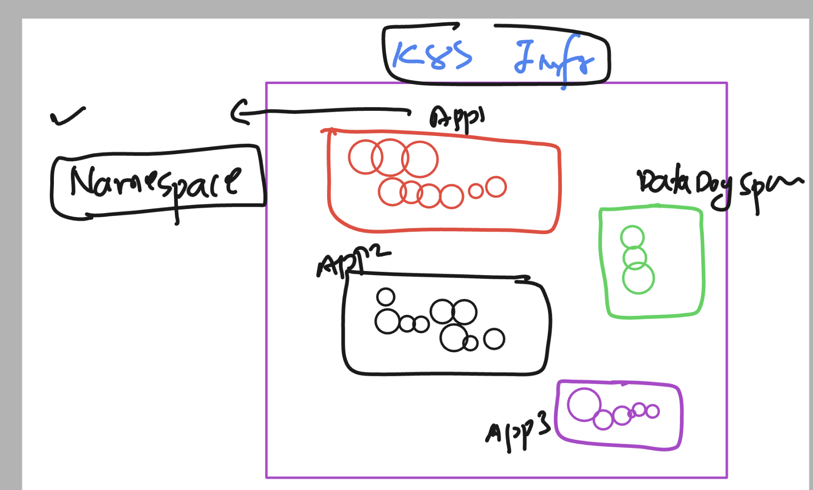
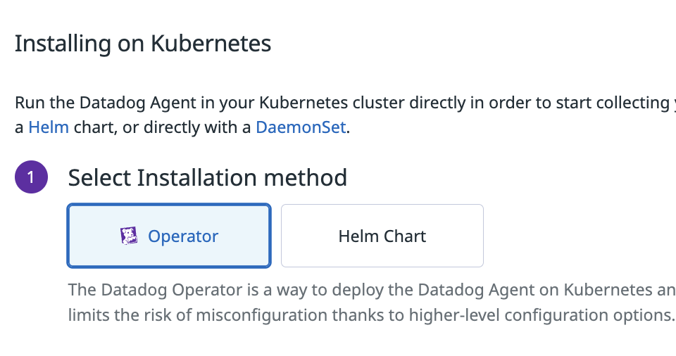

# datadog-fundamental_training

### Revision 1 



### Revision understanding for custom metric 



### final revision 



### introduction to logging via datadog 



### by default logging is disabled -- veriy that

```
 cd  /etc/datadog-agent/
root@ip-172-31-90-155:/etc/datadog-agent# ls
auth_token    conf.d                install_info                 selinux
checks.d      datadog.yaml          runtime-security.d           system-probe.yaml.example
compliance.d  datadog.yaml.example  security-agent.yaml.example


root@ip-172-31-90-155:/etc/datadog-agent#
root@ip-172-31-90-155:/etc/datadog-agent# grep -in logs  datadog.yaml
36:## setting defined in "site". It does not affect APM, Logs or Live Process intake which have their
48:## For Logs proxy information, refer to https://docs.datadoghq.com/agent/proxy/#proxy-for-logs
568:  ## - logs_config.use_http
569:  ## - logs_config.logs_no_ssl
570:  ## - logs_config.logs_dd_url
611:  ## @param  logs - custom object - optional
612:  ## Specific configurations for logs
614:  # logs:
617:    ## @env DD_OBSERVABILITY_PIPELINES_WORKER_LOGS_ENABLED - boolean - optional - default: false
618:    ## Enables forwarding of logs to an Observability Pipelines Worker
623:    ## @env DD_OBSERVABILITY_PIPELINES_WORKER_LOGS_URL - string - optional - default: ""
624:    ## URL endpoint for the Observability Pipelines Worker to send logs to
1062:## @param logs_enabled - boolean - optional - default: false
1063:## @env DD_LOGS_ENABLED - boolean - optional - default: false
1064:## Enable Datadog Agent log collection by setting logs_enabled to true.
1**066:# logs_enabled: false**
```

### exam preferd answer 

```
 datadog-agent  status   |  grep -i logs
    config_logs_dd_url:
    config_logs_socks5_proxy_address:
    feature_logs_enabled: false
Logs Agent
  Logs Agent is not running
```

## enabling log component under datadog agent -- use any editor to edit setting like given below 

```
datadog.yaml ---

====
logs_enabled: true

=====>> restarting agent
systemctl restart datadog-agent

===>verify by datadog-agent status 
```

### enable docker loggin in host based datadog agent 

### datadog.yaml 

```

logs_enabled: true
listeners:
    - name: docker
config_providers:
    - name: docker
      polling: true
logs_config:
    container_collect_all: true

```

### restart datadog agent 

### monolith to microservices



### introduction to kubernetes 



### AKS + datadog



### final understanding of datadog agent deployment in a particular namespace in AKS 



### checking k8s connection 

```

ashu@ip-172-31-33-254:~$ kubectl  cluster-info  --kubeconfig  /tmp/config
Kubernetes control plane is running at https://k8s-dev-dns-4xd4wbq8.hcp.eastus.azmk8s.io:443
CoreDNS is running at https://k8s-dev-dns-4xd4wbq8.hcp.eastus.azmk8s.io:443/api/v1/namespaces/kube-system/services/kube-dns:dns/proxy
Metrics-server is running at https://k8s-dev-dns-4xd4wbq8.hcp.eastus.azmk8s.io:443/api/v1/namespaces/kube-system/services/https:metrics-server:/proxy

To further debug and diagnose cluster problems, use 'kubectl cluster-info dump'.
ashu@ip-172-31-33-254:~$
ashu@ip-172-31-33-254:~$
ashu@ip-172-31-33-254:~$
ashu@ip-172-31-33-254:~$ cp -v  /tmp/config   .kube/
'/tmp/config' -> '.kube/config'
ashu@ip-172-31-33-254:~$
ashu@ip-172-31-33-254:~$
ashu@ip-172-31-33-254:~$
ashu@ip-172-31-33-254:~$ kubectl  cluster-info
Kubernetes control plane is running at https://k8s-dev-dns-4xd4wbq8.hcp.eastus.azmk8s.io:443
CoreDNS is running at https://k8s-dev-dns-4xd4wbq8.hcp.eastus.azmk8s.io:443/api/v1/namespaces/kube-system/services/kube-dns:dns/proxy
Metrics-server is running at https://k8s-dev-dns-4xd4wbq8.hcp.eastus.azmk8s.io:443/api/v1/namespaces/kube-system/services/https:metrics-server:/proxy

To further debug and diagnose cluster problems, use 'kubectl cluster-info dump'.
ashu@ip-172-31-33-254:~$
ashu@ip-172-31-33-254:~$
ashu@ip-172-31-33-254:~$ kubectl   get   nodes
NAME                                STATUS   ROLES   AGE     VERSION
aks-agentpool-35575125-vmss000000   Ready    agent   4h38m   v1.27.7
aks-agentpool-35575125-vmss000001   Ready    agent   4h38m   v1.27.7
ashu@ip-172-31-33-254:~$

```

### datadog agent setup on AKS using given methods



## Datadog agent logs 

```
root@ashu-ubuntu:/etc/datadog-agent# cd  /var/log/datadog/
root@ashu-ubuntu:/var/log/datadog# ls
agent.log  process-agent.log  trace-agent.log
root@ashu-ubuntu:/var/log/datadog# 


```

# Exam Info 

## linux basic command 

### checking tcp and udp port number started by datadog agent 

```
netstat -nltp
Active Internet connections (only servers)
Proto Recv-Q Send-Q Local Address           Foreign Address         State       PID/Program name    
tcp        0      0 127.0.0.1:5012          0.0.0.0:*               LISTEN      898280/trace-agent  
tcp        0      0 127.0.0.1:5000          0.0.0.0:*               LISTEN      898278/agent        
tcp        0      0 127.0.0.1:5001          0.0.0.0:*               LISTEN      898278/agent        
tcp        0      0 0.0.0.0:22              0.0.0.0:*               LISTEN      797682/sshd: /usr/s 
tcp        0      0 127.0.0.53:53           0.0.0.0:*               LISTEN      531/systemd-resolve 
tcp        0      0 127.0.0.1:6162          0.0.0.0:*               LISTEN      898279/process-agen 
tcp        0      0 127.0.0.1:8126          0.0.0.0:*               LISTEN      898280/trace-agent  
tcp        0      0 127.0.0.1:6062          0.0.0.0:*               LISTEN      898279/process-agen 
tcp        0      0 127.0.0.1:40507         0.0.0.0:*               LISTEN      2808/containerd     
tcp6       0      0 :::80                   :::*                    LISTEN      852784/apache2      
tcp6       0      0 :::22                   :::*                    LISTEN      797682/sshd: /usr/s


========>>> UDP

netstat -nlup
Active Internet connections (only servers)
Proto Recv-Q Send-Q Local Address           Foreign Address         State       PID/Program name    
udp        0      0 127.0.0.1:323           0.0.0.0:*                           662/chronyd         
udp        0      0 127.0.0.1:8125          0.0.0.0:*                           898278/agent        
udp        0      0 127.0.0.53:53           0.0.0.0:*                           531/systemd-resolve 
udp        0      0 10.0.0.4:68             0.0.0.0:*                           529/systemd-network 
udp6       0      0 ::1:323                 :::*                                662/chronyd        
```
